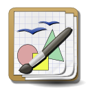

# <a name="JPaint"></a>JavaPaint - A java based paint program [](https://github.com/DemonFangs/Java-Paint)

[](http://github.com/badges/stability-badges)
[](https://github.com/ellerbrock/open-source-badge/)

* [How to Run the Program](#toRun)
* [Design and Concept](#design)
* [Features](#features)
* [Contributors](#contributors)

## <a name="toRun"></a> How to Run the Program

- Compile
```sh
			javac JavaPaint.java
```

- Run
```sh
			java JavaPaint
```


## <a name="design"></a> Design and Concept

The design for this program is to emulate a painting program. Users can draw what 
they want using a pointe and click device ( a mouse ), and the image will be 
displayed on the screen. The user will have a variety of tools to use in order 
to draw different objects and manipulate an image that has already been drawn. 
The idea is to keep the design simple so that the user is familiar with the layout. 

## <a name="features"></a> Features

The tool bar is allowed to be removed from the main windows so the user has more
space to work with if need be. The user will also be able to import an image and
edit the imported image using said tools.

To generate a javadoc for the program copy paste the following command in the terminal:
```sh
javadoc -tag param -tag.:a:"Precondition: " -tag return -d javadoc/ *.java
```
you can change the directory (if you wish) to store the generated javadoc.

## <a name="contributors"></a> Contributors

* [Khadem Avinoor Alam](https://github.com/DemonFangs/)
* [Jhanperera](https://github.com/jhanperera)
* [Bilal]